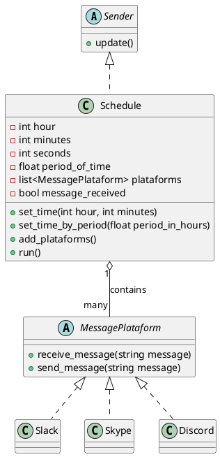

```plantuml
@startuml
abstract Sender {
  + update()
}
class Schedule{
  - int hour
  - int minutes
  - int seconds
  - float period_of_time
  - list<MessagePlataform> plataforms
  - bool message_received

  
  + set_time(int hour, int minutes)
  + set_time_by_period(float period_in_hours)
  + add_plataforms()
  + run()
}
abstract MessagePlataform {
  + receive_message(string message)
  + send_message(string message)
}

class Slack{
}
class Skype{
}
class Discord{
}
Sender <|.. Schedule

MessagePlataform <|.. Slack
MessagePlataform <|.. Skype
MessagePlataform <|.. Discord
Schedule "1" o-- "many" MessagePlataform : contains
@enduml
```
